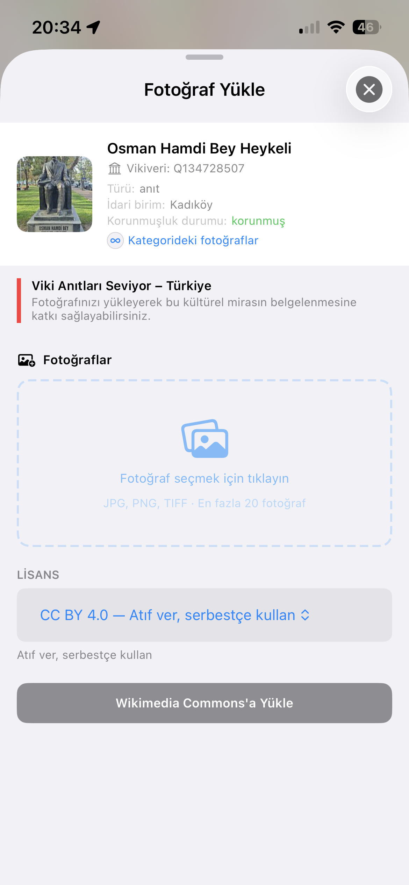

# Wiki Loves Monuments Turkey

<p align="center">
  
</p>

<p align="center">
  <strong>Türkiye'deki kültürel miras anıtlarını belgelemek için geliştirilmiş iOS uygulaması</strong><br>
  <em>iOS app for documenting cultural heritage monuments in Turkey</em>
</p>

<p align="center">
  <a href="https://commons.wikimedia.org/wiki/Commons:Wiki_Loves_Monuments">
    
  </a>
  <a href="https://www.wikidata.org/wiki/Wikidata:Main_Page">
    
  </a>
  <a href="https://commons.wikimedia.org/">
    
  </a>
  
  
</p>

---

## Screenshots

<p align="center">
  
  
  
  
</p>

---

## About

**Wiki Loves Monuments** (WLM) is the world's largest photography competition, focused on cultural heritage monuments. This app helps participants in Turkey discover nearby monuments, take photos, and upload them directly to [Wikimedia Commons](https://commons.wikimedia.org/).

The app contains data for **65,000+** registered cultural heritage monuments across Turkey, sourced from [Wikidata](https://www.wikidata.org/).

## Features

### 🗺️ Interactive Map
- Browse all registered monuments on a clustered map
- Filter by **all**, **without photo**, or **with photo**
- Color-coded markers: 🔴 needs photo, 🟢 has photo
- Tap any marker to see monument details and upload photos
- Follow mode keeps the map centered on your location

### 🔍 Search
- Search monuments by name in Turkish or English
- Instant results from the local database

### 📸 Photo Upload
- Upload photos directly to Wikimedia Commons
- Automatic wikitext generation with proper templates (`{{Information}}`, `{{Location}}`, `{{on Wikidata}}`)
- Smart category management with subcategory browsing
- Bilingual descriptions (Turkish + English) auto-filled from Wikidata
- Auto-generated filenames based on monument and category names
- Set monument image (P18) on Wikidata after first upload

### 🖼️ Photos
- **Needs Photo**: Nearby monuments without photos, sorted by distance
- **Recent Uploads**: Latest WLM Turkey uploads from all contributors
- **My Uploads**: Your own upload history with full metadata

### 👤 Profile
- OAuth 1.0a authentication for Wikimedia Commons
- Single login works across all Wikimedia sites (Commons, Wikidata)

### ⚙️ Settings
- Turkish / English language support
- Light / Dark / System theme
- Adjustable cluster radius
- Data source information with update date

## Tech Stack

| Component | Technology |
|-----------|-----------|
| UI Framework | SwiftUI |
| Map | Leaflet.js via WKWebView |
| Clustering | Leaflet.markercluster |
| Authentication | OAuth 1.0a (HMAC-SHA1) |
| Token Storage | iOS Keychain |
| Upload | Wikimedia Commons API (multipart) |
| Data | Wikidata API (wbgetentities, wbcreateclaim) |
| Monument Data | Wikidata SPARQL → JSON (auto-updated monthly) |

## Requirements

- iOS 17.0+
- Xcode 15.0+
- A [Wikimedia account](https://commons.wikimedia.org/wiki/Special:CreateAccount) for uploading

## Getting Started

1. Clone the repository:
   ```bash
   git clone https://github.com/Sadrettin86/WLMTurkey.git
   ```
2. Open `WLMTurkey.xcodeproj` in Xcode
3. Build and run on a simulator or device

## Monument Data

The app includes a bundled `monuments.json` with 65,000+ monuments. This file is updated automatically via GitHub Actions on the 1st of each month, and can also be triggered manually.

The app checks for updates from GitHub every 7 days and downloads the latest data in the background.

## Contributing

Contributions are welcome! Please open an issue or submit a pull request.

For discussion and feedback:
**[Commons talk: Wiki Loves Monuments in Turkey](https://commons.wikimedia.org/w/index.php?title=Commons_talk:Wiki_Loves_Monuments_in_Turkey)**

## License

This project is licensed under the **GNU Affero General Public License v3.0** — see the [LICENSE](LICENSE) file for details.

## Acknowledgments

- [Wikimedia Commons](https://commons.wikimedia.org/) — media repository
- [Wikidata](https://www.wikidata.org/) — structured data
- [OpenStreetMap](https://www.openstreetmap.org/) — map tiles
- [Leaflet](https://leafletjs.com/) — interactive maps
- [Wiki Loves Monuments](https://www.wikilovesmonuments.org/) — the competition
